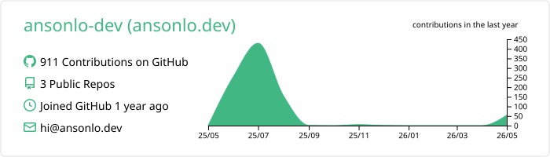
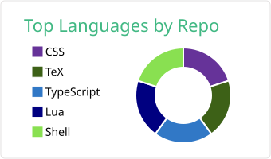
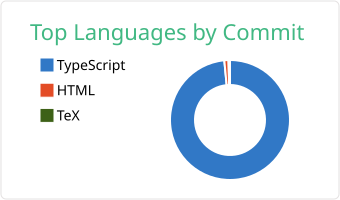
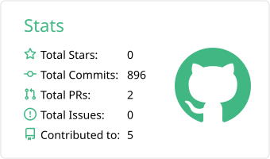
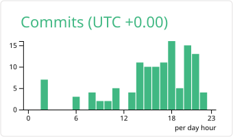

<!-- ============================ BANNER ============================ -->

<!-- ============================ TYPING ============================ -->

<!-- ============================ SOCIAL ROW ============================ -->

  
  
  

  
  
  

---

## 🧭 About Me

A **Hong Kong-based developer** and **Lingnan University** undergrad living at the intersection of **code, design, and numbers** 🧮

---

## 🚀 Featured Project

  

### *Let every review be a guiding light on your learning journey* ✨

> **LingUBible** is a trilingual (EN / 繁中 / 简中) course and lecturer review platform built specifically for Lingnan University students. It helps undergrads make informed academic choices, share authentic learning experiences, and find the right courses faster.

**🌐 [Visit Live Site](https://lingubible.com)** · **📖 [Documentation](https://github.com/ansonlo-dev/LingUBible/tree/main/docs)** · **💻 [Source Code](https://github.com/ansonlo-dev/LingUBible)** · **☕ [Support on Ko-fi](https://ko-fi.com/lingubible)**

---

## 🛠️ Tech Stack

### Languages

  
  
  
  
  
  

### Frontend

  
  
  
  
  

### Backend & Cloud

  
  
  
  

### Tools & Workflow

  
  
  
  
  
  

---

## 📊 GitHub Stats

<!-- These SVGs are generated nightly by a GitHub Action and committed to this repo.
     They're hosted on GitHub itself — no Vercel rate limits, no broken images.
     See the setup instructions at the bottom of this section. -->

  

  

  

<!-- Streak stats — hosted on demolab.com (NOT vercel), so unaffected by the vercel paused deployment -->

  

<!-- Activity graph — separate Vercel deployment, currently still active -->

  

<!-- Trophies — separate Vercel deployment, currently still active -->

---

## 🌐 Let's Connect

I'm always open to interesting conversations — whether it's a project idea, a question, or just to say hi.

 

<a href="https://www.linkedin.com/in/ansonlo-dev">

</a>

---

### ✨ "Ship things that real people use. Everything else is practice."

 

